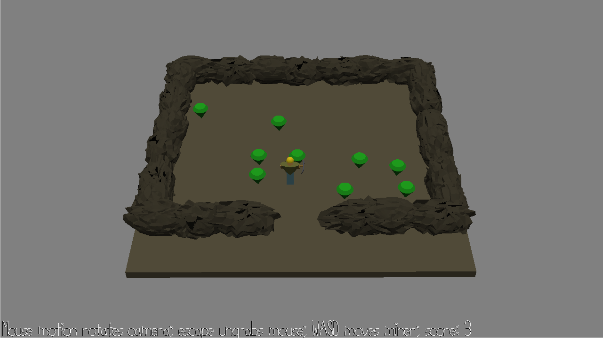

# (TODO: your game's title)

Author: Anna Li

Design: (TODO: In two sentences or fewer, describe what is new and interesting about your game.)

Screen Shot:

How To Play:

(TODO: describe the controls and (if needed) goals/strategy.)

Sources: Canary singing from https://youtu.be/cRMdlSfFMwI, uploaded under the Creative Commons license

This game was built with [NEST](NEST.md).

